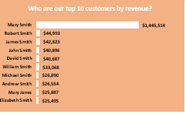

# Supplychain_Analysis
## By Chinaza Deborah Emerengini

---
# INTRODUCTION
This project presents a comprehensive analysis of supply chain operations using Microsoft Excel as the primary analytical tool. The dataset contains transactional records related to product orders, shipment timelines, customer regions, and sales performance, simulating the core processes of a mid-sized logistics or retail company. The analysis focuses on uncovering operational insights through data transformation, pivot tables, KPI tracking, and data visualization. Key areas of focus include order fulfillment efficiency, category-level sales trends, delivery lead times, and regional performance patterns. This project demonstrates a practical application of spreadsheet-based analytics for business intelligence and supply chain management. It showcases expertise in transforming raw operational data into meaningful insights that support data-driven decision-making, operational optimization, and performance monitoring.

---
# PROBLEM STATEMENT
I undertook this project to explore, analyze, and extract insights from a structured supply chain dataset using Microsoft Excel. The goal was to transform raw transactional data into meaningful information that could support decision-making in logistics, operations, and inventory management. While working with the dataset, I focused on answering the following key business questions:
* Which product category generated the most sales?
* Which customer generated the most revenue for the company?
* What is the average time between order date and ship date?
* Which region had the highest number of orders?
* How many units were sold per product?
* Which product category has the fastest delivery rate?
* What is the relationship between quantity sold and profit generated?
  
  ---
# DATA SOURCING
The dataset used in this project was provided as part of a structured learning assignment. It contains transactional records related to customer orders, shipping details, product information, and regional sales activity.

---
# SKILLS DEMONSTRATED
* I performed advanced Excel-based data analysis, organizing and interpreting raw supply chain data to uncover actionable insights.
* I built dynamic pivot tables to summarize and filter data across customer segments, product categories, and regions.
* I developed and monitored key performance indicators (KPIs), including total sales, delivery timelines, units sold, and revenue per  customer.
* I designed interactive charts and dashboards to visually communicate trends in sales, shipping delays, and product performance.
* I used advanced Excel functions such as IF, VLOOKUP, AVERAGEIF, and date logic to perform calculations and highlight patterns.
*  I extracted business insights that could inform operational decisions around inventory planning, logistics efficiency, and regional strategy.
* I structured and documented the analysis in a way that is clear and professional, making it accessible to both technical and non-technical stakeholders.
  
  ---
# ANALYSIS & VISUALIZATION
I used Microsoft Excel to explore and visualize supply chain performance data. The analysis focused on answering key business questions using pivot tables, formulas, and charts. Below are screenshots of the overall dashboard and individual charts, along with the business questions they address.

---
# Overall Dashboard View

A consolidated dashboard showing KPIs, regional breakdowns, category sales, top customers, and order-to-ship timelines.

---
#### Which product category generated the most sales?

This bar chart highlights the total sales across each product category, helping to identify top-performing product lines.

---
#### Which customer generated the most revenue for the company?

A bar chart ranking the top 10 customers based on total revenue, spotlighting the company’s key clients.

---
#### What are the top 5 countries that sold the most in terms of quantity?

A bar chart showing the top five countries by quantity sold, identifying regions with the highest demand volume.

---
#### Which customer segment generated the most revenue?

A pie chart showing the revenue contribution of each customer segment, highlighting the most profitable customer types.

---
#### Which shipping mode is the most common for our customers?

A pie chart showing the distribution of orders by shipping mode, providing insight into delivery preferences and logistics performance.

---
#### What is the percentage of cancelled orders? Is it high and should it be of any concern?

A vertical bar chart comparing all order statuses by count and percentage. Cancelled orders represent just 2% of total orders, suggesting that order cancellation is relatively low and may not be an urgent concern.

---
# Key Business Insights
#### 1. Customer Revenue Concentration
* Mary Smith is the highest-revenue customer, contributing approximately $1.4 million ($1,445,514).
* The top 3 customers generate a substantial share of total revenue, revealing a high customer concentration risk.

#### 2. Segment Performance
* Consumer segment contributes the highest revenue share at 53%.
* Corporate (29%) and Home Office (18%) segments follow.
* This suggests strong B2C performance, but also potential in growing B2B and remote work-related segments..

#### 3. Top Markets
* The United States (Estados Unidos) leads with 15,704 units sold, followed by Mexico and France.
* The U.S. represents the most active sales region and should be prioritized for logistics and distribution strategies.
  
#### 4. Product Category Trends
* Men’s Footwear is the leading category with $1,553,900 in revenue.
* Fishing and Water Sports are the next top performers.
* These categories reflect a strong interest in outdoor and lifestyle products, suggesting areas to expand.

#### 5. Shipping Mode Usage
* Standard Class is the most widely used shipping method with 39,324 orders.
Followed by:
* Second Class: 12,778 orders
* First Class: 10,079 orders
* Same Day: 3,571 orders
* This implies that customers prefer cost-effective shipping, but there is room to explore improvements in faster delivery tiers.

#### Order Cancellations & Data Quality
* Complete orders: 21,716 (33%)
* Cancelled orders: 1,367 (2%)
* Payment Review: 704 (1%)
* The vast majority of transactions are completed successfully, showing healthy order fulfillment. A small 2% cancellation rate is within acceptable operational benchmarks.
* Focus should shift from fixing cancellations to improving payment processing and reviewing bottlenecks in "Payment Review" orders to increase order throughput

# Recommendation
#### Based on the insights uncovered in this analysis, the following strategic actions are recommended:
* Diversify High-Value Customer Dependence
While Mary Smith alone contributed over $1.4 million in revenue, relying heavily on a few top customers poses a risk. Develop loyalty programs or campaigns to engage mid-tier customers and reduce revenue concentration.
* Double Down on Men's Footwear and Outdoor Categories
With Men’s Footwear leading all product categories at $1,553,900, and Fishing and Water Sports also performing strongly, inventory, marketing, and seasonal planning should prioritize these categories.
* Strengthen Market Position in the United States
Estados Unidos generated the highest product quantity (15,704 units), making it a key market. Consider expanding logistics efficiency and customer engagement strategies in this region.
* Address Cancellations and Payment Bottlenecks
With 2% of orders (1,367) cancelled and 1% (704) in payment review, efforts should focus on minimizing cancellations through improved stock visibility and communication, while also streamlining payment verification to reduce delays and recover potential revenue.
* Refine Shipping Strategy Based on Preferences
With over 39,000 orders using Standard Class, cost-efficiency appears to be a customer priority. Consider maintaining or optimizing Standard Class while evaluating how to make premium options more appealing.

# Conclusion
This project demonstrates how Excel can be leveraged as a powerful tool for extracting meaningful insights from complex supply chain data. From identifying top customers and high-performing product categories to evaluating shipping preferences and order status trends, the analysis provides actionable recommendations that support smarter decision-making.
By transforming raw transactional records into a structured, visual story, this project highlights the importance of data clarity, customer behavior insights, and operational efficiency in driving business performance. It showcases the real-world application of data analytics in supply chain management and reinforces the value of thoughtful visualization in uncovering what truly matters.
